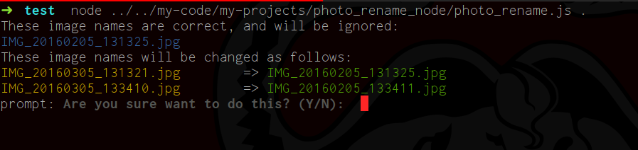

# Photo Rename #

This is a Nodejs port of my original script written in Ruby. Currently it provides around 80% of the functionality of the original, and everything that I needed for my personal use. The plan is to deprecate the Ruby script since I am now mostly working in Nodejs and are much more capable in that language.

## Installation ##
The only dependency is for the script is that `Nodejs` and `npm` be installed.

To install the script itself:
```bash
npm install photo_rename
```

## What the script does ##

This script is fairly specific. It renames all JPG files (technically files with a .jpg or .jpeg extenstion) in a given directory to the form `IMG_yyyymmdd_hhmmss.jpg`

## Rationale ##

The naming pattern described above is the naming pattern used by the stock Android camera. Renaming photos taken with other devices to this scheme allows me to seamlessly merge photos into a single directory and maintain consistent file names.


~~**IMPORTANT NOTE**~~
~~Since we are renaming files based on the date created by the device that created the file, this device's date should be correctly set. (For the next release I want to add more options to change the date with some offset)~~

## Usage ##
```bash
photo_rename [directory]
```




## Change log ##

### 0.1.0 ###
First release of the Nodejs port

### License ###

This program is licensed under [(<http://www.gnu.org/licenses/gpl-3.0.txt>)[GNU GPL]]
